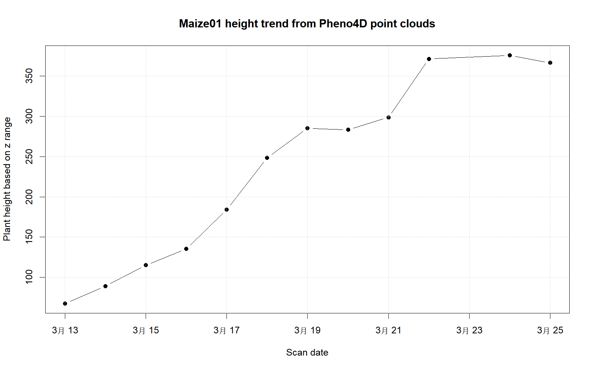

# 研究背景

本项目复现 Schunck et al. (2021) 发布的 Pheno4D 数据集中玉米点云的时序表型分析思路。Pheno4D 数据集提供玉米和番茄的多时相三维点云数据，可用于植物表型提取、器官分割、时间序列分析等任务。

本项目不完整复现论文中的深度学习分割模型，而是选取玉米点云数据，围绕“点云数据能否用于提取玉米株高并描述生长变化”这一主结果开展轻量级复现。

# 数据来源

原始数据来自 Pheno4D 公开数据集。由于原始数据体积较大，本仓库不上传 `Pheno4D.zip` 和解压后的原始点云文件，只保留数据来源说明、处理脚本、处理后的结果表和可视化结果。

本项目当前选取 `Maize01` 这一株玉米的 12 个时相点云文件进行分析。

# 数据预处理

Pheno4D 的玉米点云文件包括两种格式：

- 带 `_a` 的标注文件：包含 `x, y, z, semantic_label, instance_label` 五列；
- 不带 `_a` 的普通点云文件：包含 `x, y, z` 三列。

本项目暂不使用语义标签，只基于第三列 `z` 坐标提取玉米株高。计算方式为：

\[
Height = max(z) - min(z)
\]

该指标可以反映单株玉米在不同扫描日期下的垂直高度变化。

# 分析代码

本项目使用 `scripts/01_extract_maize01_height.R` 完成数据读取、株高计算、结果表导出和趋势图绘制。

```{r}
height_data <- read.csv("data/processed/maize01_height.csv")

height_data
```

# 结果可视化

```{r}
height_data$scan_date <- as.Date(height_data$scan_date)

plot(
  height_data$scan_date,
  height_data$height_z_range,
  type = "b",
  pch = 19,
  xlab = "Scan date",
  ylab = "Plant height based on z range",
  main = "Maize01 height trend from Pheno4D point clouds"
)
grid()
```

也可以直接查看脚本输出的图片：



# 结果解读

从结果可以看出，`Maize01` 的点云高度总体随扫描日期增加而上升，说明三维点云能够较好地反映玉米单株在连续观测期内的生长变化。早期扫描日期的株高较低，后期株高明显增加，这与玉米营养生长期植株快速伸长的基本规律一致。

需要注意的是，本项目使用的是 `z` 坐标范围作为株高的近似指标。该方法简单、可重复，适合作为课程项目的轻量级复现方案。但它也可能受到地面点、噪声点和扫描坐标系差异的影响。若进一步提高精度，可以在后续分析中加入地面点过滤、语义标签筛选或更严格的点云配准方法。

# 复现说明

完整复现流程如下：

1. 下载 Pheno4D 原始数据；
2. 解压 `Pheno4D/Maize01/` 文件夹；
3. 运行 `scripts/01_extract_maize01_height.R`；
4. 生成 `data/processed/maize01_height.csv`；
5. 生成 `results/figures/maize01_height_trend.png`；
6. 运行 `quarto render` 生成网页报告。

# 小结

本项目完成了从原始点云数据、数据预处理、表型指标提取、可视化分析到 Quarto 报告生成的完整流程。虽然复现范围较小，但覆盖了课程要求中的数据来源说明、数据分析及可视化、研究报告和可重复性说明。